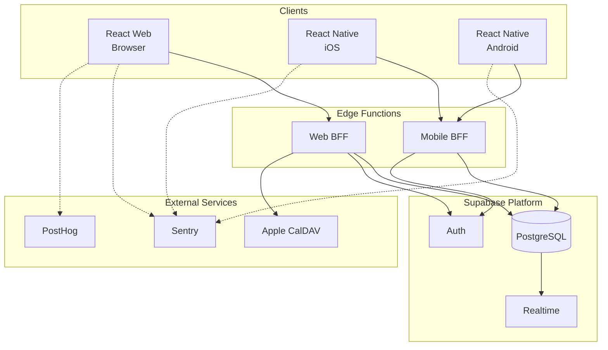

# Constellation 2 Preparation Assessment

**Date:** 2026-02-03
**Purpose:** Assess Constellation docs for updates before second implementation run

---

## Executive Summary

The Constellation docs (PRD, Architecture, UX-Design, External-Services-Setup) are **fundamentally sound**. The first implementation failed not because of poor documentation, but because:

1. Pipeline silently dropped scope (mobile app)
2. No explicit data layer setup step
3. Architecture was ignored (real-time → polling, CalDAV → stub)
4. Client observability was documented but not installed

**Recommendation:** Minor doc updates, focus on pipeline execution with new META verification gates.

---

## Document Assessment

### PRD-constellation.md ✅ NO CHANGES NEEDED

The PRD correctly specifies:
- Web app (React) ✓
- iOS app (React Native) ✓
- Android app (React Native) ✓
- Real-time sync across all platforms ✓
- Two-way sync with Apple Calendar (CalDAV) ✓
- All Must-Have features are clear ✓

**The problem:** The orchestrator silently dropped mobile. The PRD is correct.

---

### ARCHITECTURE.md 🔧 MINOR UPDATES

**Current state:** Good architecture with clear decisions. Has observability section.

**Issues found:**
1. Uses ASCII art diagrams instead of Mermaid (META standard)
2. Missing explicit "Data Layer Setup" section

**Recommended updates:**

#### 1. Convert System Overview to Mermaid

Replace ASCII diagram with:


#### 2. Add Data Layer Requirements Section

Add after "Real-Time Architecture" section:

```markdown
## Data Layer Requirements

### Mandatory Setup Before Frontend Implementation

The following MUST be in place before any frontend UI work begins:

1. **Generated TypeScript types**
   ```bash
   supabase gen types typescript --project-id <id> > packages/shared-types/src/database.ts
   ```

2. **QueryClientProvider in app entry**
   ```typescript
   // apps/web/src/main.tsx
   const queryClient = new QueryClient();
   <QueryClientProvider client={queryClient}>
     <App />
   </QueryClientProvider>
   ```

3. **Typed Supabase client**
   ```typescript
   // apps/web/src/lib/supabase.ts
   import { createClient } from '@supabase/supabase-js';
   import type { Database } from '@/types/database';
   export const supabase = createClient<Database>(url, key);
   ```

4. **Auth context and hooks**
   - `useAuth()` - current session, sign in/out
   - `useCurrentUser()` - current user profile

5. **Entity hooks for each domain object**
   - `useConstellations()` - list user's constellations
   - `useConstellation(id)` - single constellation with members
   - `useEvents(constellationId, dateRange)` - calendar events
   - `useMeals(constellationId, dateRange)` - meal plans
   - `useTasks(constellationId)` - task list
   - `useRecipes(constellationId?)` - recipe library

### Exit Criteria

Data layer is complete when:
- [ ] All hooks can be imported without errors
- [ ] A test component renders real data from Supabase
- [ ] Loading, error, and empty states are handled
```

---

### UX-DESIGN.md ✅ NO CHANGES NEEDED

The UX design is comprehensive with:
- Mermaid user flows ✓
- ASCII wireframes (acceptable for wireframes) ✓
- Component inventory ✓
- Responsive behavior ✓
- Accessibility requirements ✓

---

### EXTERNAL-SERVICES-SETUP.md ✅ NO CHANGES NEEDED

Already updated for:
- New Supabase key format (publishable/secret) ✓
- Sentry setup ✓
- PostHog setup ✓
- Vercel/Netlify setup ✓

---

## First Run Failures Analysis

| Issue | Root Cause | Fix for Second Run |
|-------|------------|-------------------|
| Mobile app dropped | Orchestrator silently reduced scope | Scope verification gate will catch |
| Mock data in production | No data layer setup step | Explicit data layer step in pipeline |
| CalDAV not implemented | Treated as optional | Mark as Must-Have blocker |
| Real-time not implemented | Agent chose simpler approach | Architecture verification gate |
| Client observability missing | Not enforced | Quality gate checks for @sentry/react |
| CI only, no CD | Incomplete DevOps step | Quality gate checks for deploy workflow |

---

## Recommended Pipeline Changes for Constellation 2

### 1. Use Scope Verification Gate

After orchestrator generates pipeline:
```bash
./scripts/scope-verification.sh --project ~/code/constellation-2
```

Must pass before execution. Will catch mobile app omission.

### 2. Explicit Data Layer Step

Add step between backend and frontend:
```
N | base | auto | - | 30 | DATA LAYER SETUP: Generate Supabase types, create QueryClientProvider, create auth hooks, create entity hooks for all domain objects. Verify by importing hooks in test component.
```

### 3. Architecture Verification

Before DoD, verify:
- [ ] Supabase Realtime subscriptions exist (not just React Query polling)
- [ ] CalDAV integration exists (not stub)
- [ ] Mobile app exists (not just web)

### 4. Client Observability Check

Quality gate already checks for `@sentry/react` and `posthog-js` in package.json.

### 5. CD Workflow Check

Quality gate already checks for deploy workflow or platform config.

---

## Scope Decision for Constellation 2

### Option A: Full PRD Scope (Recommended for Testing)
- Web app ✓
- iOS + Android mobile apps ✓
- CalDAV integration ✓
- Real-time sync ✓
- All Must-Have features ✓

This tests the full META verification architecture.

### Option B: Web-Only with Deferred Mobile
- Web app only
- Mobile explicitly deferred in `docs/DEFERRED.md`
- CalDAV integration
- Real-time sync

This is faster but doesn't fully test scope verification.

### Option C: MVP Subset with Documentation
- Web app only
- Mobile deferred
- CalDAV deferred
- Real-time ✓

Must have explicit deferrals approved.

**Recommendation:** Option A for complete verification testing. If time-constrained, Option B with proper deferral documentation.

---

## Files to Update in constellation-2

### Before Pipeline Execution

1. **Copy docs from constellation to constellation-2**
   ```bash
   cp -r ~/code/constellation/docs ~/code/constellation-2/
   ```

2. **Update ARCHITECTURE.md**
   - Convert ASCII system diagram to Mermaid
   - Add Data Layer Requirements section

3. **Create docs/REQUIREMENTS_TRACKING.md**
   - Use META template
   - List all platforms and Must-Have features
   - Initial status: all MISSING

4. **Verify .env.example exists**
   - Copy from constellation if needed

### During Pipeline Execution

The META verification gates will:
- Block if scope doesn't match PRD
- Require data layer before frontend
- Verify architecture conformance
- Check for client observability
- Check for CD workflow

---

## Summary

| Document | Status | Action |
|----------|--------|--------|
| PRD-constellation.md | ✅ Good | No changes |
| ARCHITECTURE.md | 🔧 Minor | Add Mermaid diagrams, data layer section |
| UX-DESIGN.md | ✅ Good | No changes |
| EXTERNAL-SERVICES-SETUP.md | ✅ Good | No changes |
| COMPETITIVE-ANALYSIS.md | ✅ Good | No changes |

**Key insight:** The docs were good. The execution failed because META lacked verification. The new verification architecture should prevent the same failures.

---

## Next Steps

1. Copy docs to constellation-2
2. Apply minor ARCHITECTURE.md updates
3. Create REQUIREMENTS_TRACKING.md
4. Run pipeline with META verification gates enabled
5. Verify scope verification catches any omissions
6. Verify quality gate catches observability/CD gaps
7. Document results in retrospective
