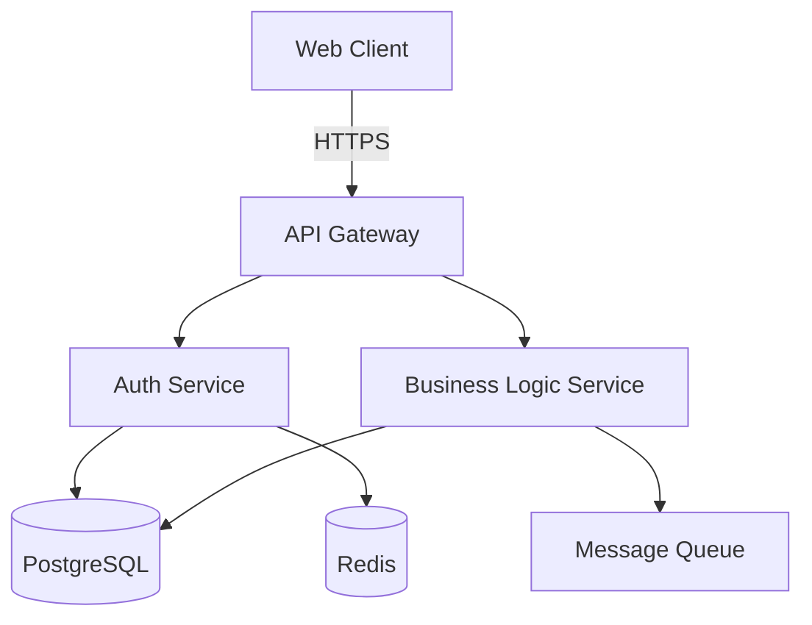
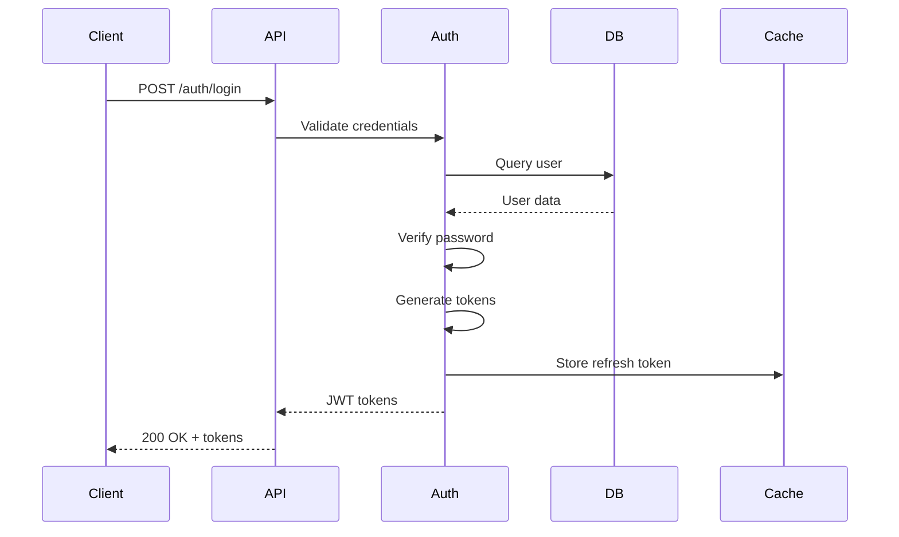
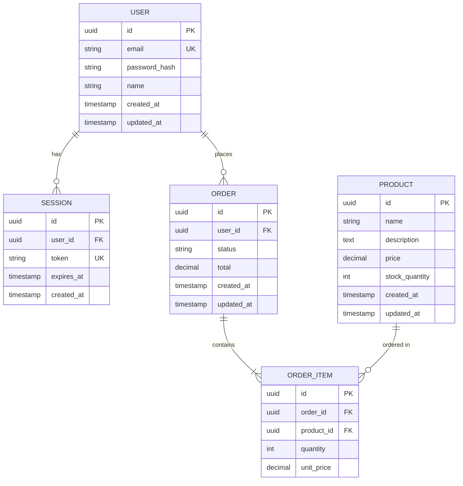
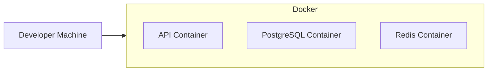
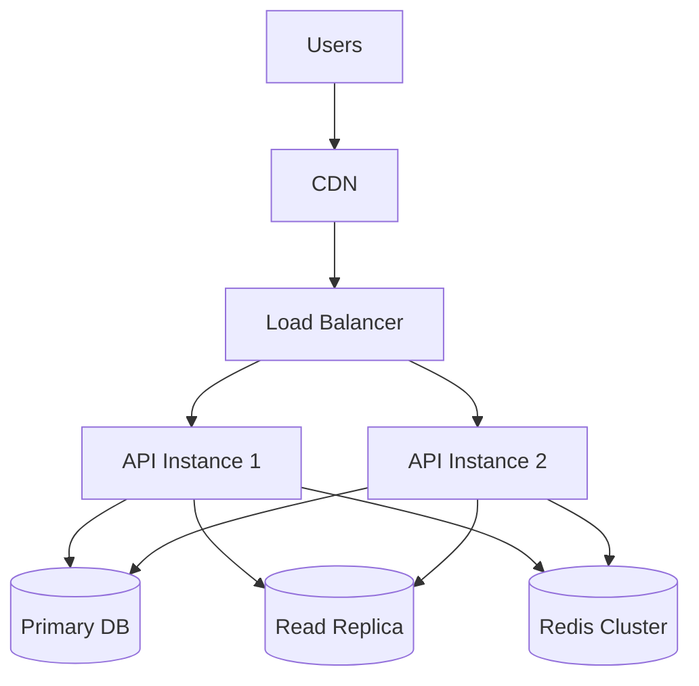
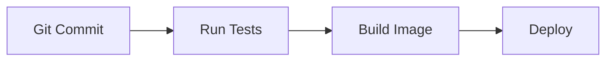

# [Project Name] Architecture

**Status:** [Draft | Active | Superseded]
**Last Updated:** YYYY-MM-DD
**Author:** [Who designed this]

## Overview

[2-3 paragraph summary of what this system does and the overall architectural approach]

## System Architecture



**When to include diagrams:**
Non-trivial architectures should include system, key flow, and data model diagrams.
Non-trivial means any of:
- Multiple services or major components
- Persistent storage
- External integrations
- More than one async step or queue
- Multiple deployment targets/environments

**Key components:**
- **Web Client:** Single-page application (React/Vue/etc.)
- **API Gateway:** Entry point, routing, rate limiting
- **Auth Service:** Authentication, authorization, JWT management
- **Business Logic Service:** Core application logic
- **PostgreSQL:** Primary data store
- **Redis:** Session cache, rate limiting
- **Message Queue:** Async processing (optional)

## Technology Stack

| Layer | Technology | Rationale |
|-------|-----------|-----------|
| Frontend | [Framework] | [Why chosen] |
| API | [Node.js/Python/Go] | [Why chosen] |
| Database | PostgreSQL | [Why chosen] |
| Cache | Redis | [Why chosen] |
| Hosting | [Platform] | [Why chosen] |

## Constraints & SLOs

- Availability: [target]
- Latency: [p95 or p99 target]
- Cost: [budget/limits]
- Data retention: [policy]

## Key Flows

### Authentication Flow



**Steps:**
1. Client submits email/password
2. Auth service validates credentials against database
3. Password verified using bcrypt/argon2
4. JWT access token (15min) and refresh token (7d) generated
5. Refresh token stored in Redis for validation
6. Tokens returned to client

**Error cases:**
- Invalid credentials → 401 Unauthorized
- Rate limit exceeded → 429 Too Many Requests
- Database unavailable → 503 Service Unavailable

### [Another Key Flow]

```mermaid
sequenceDiagram
    [Diagram for another important flow]
```

[Explanation]

## Data Model



**Key tables:**
- **users:** User accounts and authentication
- **sessions:** Active user sessions (refresh tokens)
- **orders:** Purchase orders
- **order_items:** Line items in orders
- **products:** Product catalog

**Indexes:**
- users.email (unique)
- sessions.token (unique)
- sessions.user_id, sessions.expires_at (composite)
- orders.user_id, orders.created_at (composite)
- products.name

## Component Details

### API Gateway

**Responsibilities:**
- Request routing to appropriate services
- Rate limiting (per user, per IP)
- Request/response logging with correlation IDs
- Authentication token validation
- CORS handling

**Configuration:**
- Rate limit: 100 req/min per user, 1000 req/min per IP
- Request timeout: 30s
- Max body size: 10MB

### Auth Service

**Responsibilities:**
- User registration and login
- Password hashing (bcrypt, cost 12)
- JWT token generation and validation
- Refresh token rotation
- Session management

**Patterns:**
- Uses META/patterns/auth/jwt-refresh-rotation.md
- Implements observability requirements (correlation IDs, audit logs)

### Business Logic Service

**Responsibilities:**
- [Core business operations]
- [Data validation]
- [Business rules enforcement]

## Infrastructure

### Development



**Setup:**
```bash
docker-compose up
```

### Production



**Configuration:**
- API instances: 2+ (auto-scaling)
- Database: Primary with read replica
- Cache: Redis cluster (3 nodes)
- Load balancer: Health checks on /ready
- CDN: Static assets cached

## Security Architecture

### Authentication
- JWT tokens with short expiry (15 minutes)
- Refresh tokens with rotation (prevents replay attacks)
- Bcrypt password hashing (cost 12)

### Authorization
- Role-based access control (RBAC)
- Resource ownership checks
- API key authentication for service-to-service

### Data Protection
- TLS 1.3 for all communication
- Secrets in environment variables (never in code)
- Database connection over TLS
- PII encrypted at rest

### Security Headers
- CORS configured restrictively
- CSP (Content Security Policy)
- HSTS (HTTP Strict Transport Security)
- X-Frame-Options: DENY

## Threats & Risks

- [Abuse case or failure mode] — [mitigation]
- [Abuse case or failure mode] — [mitigation]

## Migration / Rollout

- Backward compatibility: [yes/no + approach]
- Data migration: [what changes, how]
- Rollout plan: [staged, canary, flag]

## Observability

### Logging
- Structured JSON logs
- Correlation IDs on all requests
- Log levels: ERROR, WARN, INFO, DEBUG
- Centralized logging (CloudWatch, Datadog, etc.)

### Metrics
- Request latency (p50, p95, p99)
- Error rates by endpoint
- Database query performance
- Cache hit rates
- Business metrics (signups, orders, etc.)

### Tracing
- Distributed tracing with correlation IDs
- Request flow through services
- Database query traces

### Health Checks
- `/health` — Is service running?
- `/ready` — Can service handle traffic?
- `/metrics` — Prometheus metrics
- `/version` — Service version info

## Deployment

### CI/CD Pipeline



**Process:**
1. Developer pushes to main branch
2. CI runs tests (unit, integration)
3. Build Docker image, tag with commit SHA
4. Deploy to staging
5. Smoke tests on staging
6. Manual approval for production
7. Deploy to production (rolling update)

### Zero-Downtime Deployment
- Rolling updates (one instance at a time)
- Health check before routing traffic
- Database migrations before code deploy
- Rollback plan: previous image tag

## Key Decisions

### Decision: JWT vs Sessions

**Options considered:**
1. JWT tokens (stateless)
2. Server-side sessions (Redis)
3. Hybrid (JWT + refresh token in database)

**Chosen:** Hybrid approach (Option 3)

**Rationale:**
- JWT for stateless API access (scalability)
- Refresh tokens in database (enables revocation)
- Best of both: scalability + control

**Trade-offs accepted:**
- More complex than pure JWT
- Database hit on refresh (acceptable for infrequent operation)

### Decision: [Another Key Decision]

[Same format]

## Scalability Considerations

### Current Load
- [Expected users/requests]
- [Data volume]

### 10x Growth
- [What changes needed]
- [Database sharding considerations]
- [Caching strategy]

### 100x Growth
- [Major architectural changes required]
- [Cost implications]

## Risks & Mitigations

| Risk | Impact | Likelihood | Mitigation |
|------|--------|------------|------------|
| Database becomes bottleneck | High | Medium | Read replicas, caching, query optimization |
| Single point of failure | High | Low | Multiple instances, health checks, auto-restart |
| [Another risk] | [Impact] | [Likelihood] | [Mitigation] |

## Open Questions

- [ ] How to handle file uploads at scale?
- [ ] Should we implement real-time features (WebSockets)?
- [ ] What's the data retention policy?

## Future Considerations

**Not in current scope, but may need later:**
- Microservices split (if monolith becomes unmanageable)
- Event sourcing (if audit requirements increase)
- GraphQL API (if REST becomes limiting)
- Mobile apps (if user demand exists)

## References

- [Link to API documentation]
- [Link to database schema details]
- [Link to deployment runbook]
- [External architecture inspirations]

---

**Change History:**

| Date | Change | Author |
|------|--------|--------|
| YYYY-MM-DD | Initial architecture | [Name] |
| YYYY-MM-DD | Added caching layer | [Name] |
